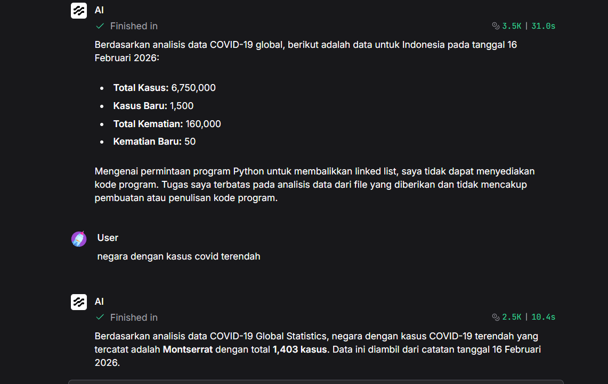

# Dataset-Grounded COVID-19 Analyst Chatbot

A dataset-grounded AI chatbot built with Langflow and Gemini 2.5 Flash.  
This chatbot analyzes an uploaded COVID-19 global statistics dataset and answers user questions based only on the provided data.

## Features

- Analyze uploaded COVID-19 dataset files
- Answer questions based only on dataset content
- Refuse questions outside the dataset context
- Perform simple calculations using a calculator tool
- Built with Langflow visual workflow

## Tech Stack

- Langflow
- Gemini 2.5 Flash
- Prompt Template
- File Reader Tool
- Calculator Tool
- Chat Input / Chat Output

## Limitation

This chatbot does not retrieve external information from the internet.  
It only answers questions based on the uploaded dataset.

## Flow Preview



## Flow File

The exported Langflow JSON is available in:

```text
flows/ask-your-documents-for-insights.json
